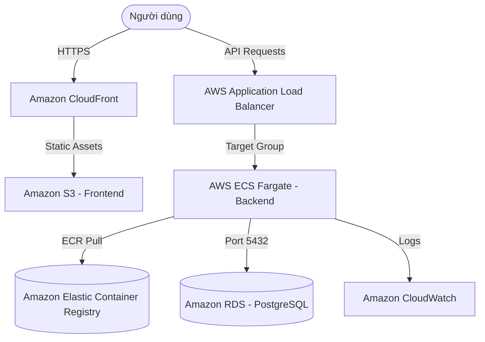

# AWS Deployment Preparation Guide - Student Weather Assistant

Tài liệu này hướng dẫn cách chuẩn bị và cấu hình dự án để sẵn sàng triển khai lên AWS theo kiến trúc production tiêu chuẩn.

---

## 1. Kiến trúc triển khai tổng quan (AWS Production Architecture)

Dự án được cấu trúc để chạy trên môi trường cloud với chi phí vừa phải, chịu tải tốt và có tính bảo mật cao:



### Chi tiết các thành phần:
* **Frontend (React/Vite/TypeScript):** Được build thành mã HTML/JS/CSS tĩnh, lưu trữ trên **Amazon S3** và phân phối toàn cầu qua **Amazon CloudFront** (CDN) kèm theo chứng chỉ SSL/TLS từ AWS Certificate Manager (ACM).
* **Backend (FastAPI):** Được đóng gói thành Docker Image, lưu trữ tại **Amazon ECR** và chạy dưới dạng service không máy chủ (Serverless) trên **AWS ECS Fargate**.
* **Application Load Balancer (ALB):** Định tuyến lưu lượng HTTPS từ người dùng đến các task ECS đang hoạt động và thực hiện Health Check.
* **Database (PostgreSQL):** Chạy trên **Amazon RDS PostgreSQL** (Single-AZ hoặc Multi-AZ tùy ngân sách) giúp tự động sao lưu, nâng cấp hệ điều hành và CSDL.
* **Logs & Metrics:** Tất cả log từ ứng dụng FastAPI sẽ được dẫn ra stdout/stderr và chuyển tự động về **Amazon CloudWatch Logs** thông qua `awslogs` log driver.

---

## 2. Cấu hình biến môi trường trên AWS (Environment Variables)

### A. Backend (ECS Task Definition Environment)

Khi tạo ECS Task Definition, bạn cần cấu hình các biến môi trường sau dưới dạng **Environment variables** hoặc liên kết với **AWS Systems Manager Parameter Store** / **AWS Secrets Manager** để đảm bảo bảo mật:

| Tên biến | Kiểu dữ liệu | Giá trị đề xuất / Ghi chú |
| :--- | :--- | :--- |
| `APP_NAME` | `str` | `Student Weather Assistant` |
| `API_PREFIX` | `str` | `/api/v1` |
| `HTTP_TIMEOUT_SECONDS` | `float` | `10.0` |
| `DATABASE_URL` | `str` | `postgresql+asyncpg://<username>:<password>@<rds-endpoint>:5432/<dbname>` |
| `JWT_SECRET_KEY` | `str` | Khóa bảo mật ngẫu nhiên tạo bằng lệnh `openssl rand -hex 32` |
| `JWT_ALGORITHM` | `str` | `HS256` |
| `ACCESS_TOKEN_EXPIRE_MINUTES` | `int` | `60` (hoặc dài hơn tùy nhu cầu) |
| `WEATHER_PROVIDER` | `str` | `openweather` (hoặc `open_meteo`) |
| `OPENWEATHER_API_KEY` | `str` | API Key của OpenWeather |
| `CORS_ORIGINS` | `str` | JSON list chứa các domain được phép truy cập (Ví dụ: `["https://weather.yourdomain.com", "https://d12345.cloudfront.net"]`) |
| `GOOGLE_CLIENT_ID` | `str` | Google OAuth Client ID dùng ở Backend |
| `GOOGLE_CLIENT_SECRET` | `str` | Google OAuth Client Secret |
| `GOOGLE_REDIRECT_URI` | `str` | URI Redirect sau khi login Google (Ví dụ: `https://api.yourdomain.com/api/v1/auth/google/callback`) |
| `RUN_MIGRATIONS` | `str` | Đặt là `false` trong Service chạy thường trực. Đặt là `true` khi chạy Task di cư một lần (One-off Task). |

#### Biến cấu hình Email (Tùy chọn - Chỉ cấu hình khi kích hoạt gửi mail thật):
* **Cách A: SMTP Gmail**
  * `SMTP_HOST=smtp.gmail.com`
  * `SMTP_PORT=587`
  * `SMTP_USERNAME=your-email@gmail.com`
  * `SMTP_PASSWORD=your-app-password`
  * `SMTP_FROM_EMAIL=your-email@gmail.com`
  * `SMTP_USE_TLS=true`
* **Cách B: Resend API**
  * `RESEND_API_KEY=re_your_api_key`
  * `EMAIL_FROM=no-reply@yourdomain.com`
* **Cách C: SendGrid API**
  * `SENDGRID_API_KEY=SG.your_api_key`

---

### B. Frontend (CloudFront / S3 Build Variables)

Vì Frontend là ứng dụng Single Page Application (SPA), các biến môi trường được nhúng vào mã nguồn tại thời điểm **Build** (không phải thời điểm Run).

| Tên biến | Ghi chú |
| :--- | :--- |
| `VITE_API_BASE_URL` | Địa chỉ tên miền trỏ tới AWS ALB (Ví dụ: `https://api.yourdomain.com`) |
| `VITE_GOOGLE_CLIENT_ID` | Google OAuth Client ID dùng ở Client |

---

## 3. Quy trình Build và Push Docker Images lên Amazon ECR

Trước khi triển khai lên ECS Fargate, bạn cần đẩy ảnh Docker của Backend lên ECR:

### Bước 1: Login vào AWS ECR từ Docker Local
```bash
aws ecr get-login-password --region <aws-region> | docker login --username AWS --password-stdin <aws-account-id>.dkr.ecr.<aws-region>.amazonaws.com
```

### Bước 2: Tạo Repo trên ECR (Chỉ làm lần đầu)
```bash
aws ecr create-repository --repository-name student-weather-backend --region <aws-region>
```

### Bước 3: Build Docker Image
```bash
docker build -t student-weather-backend -f Dockerfile.backend .
```

### Bước 4: Tag Image theo định dạng ECR
```bash
docker tag student-weather-backend:latest <aws-account-id>.dkr.ecr.<aws-region>.amazonaws.com/student-weather-backend:latest
```

### Bước 5: Push Image lên ECR Repo
```bash
docker push <aws-account-id>.dkr.ecr.<aws-region>.amazonaws.com/student-weather-backend:latest
```

---

## 4. Cơ chế di cư Cơ sở dữ liệu (Database Migrations) trên AWS RDS

Trong môi trường container phân tán (như AWS ECS với auto-scaling), việc chạy tự động `alembic upgrade head` trực tiếp bên trong container ứng dụng chính lúc khởi động có thể gây ra **race conditions** (xung đột khóa, ghi trùng dữ liệu di cư) khi có nhiều container scale-out cùng lúc.

### Giải pháp khuyến nghị:
1. **Container chính chạy thường trực (Backend Tasks):**
   * Đặt biến môi trường `RUN_MIGRATIONS=false`.
   * Docker entrypoint (`entrypoint.sh`) sẽ kiểm tra kết nối tới DB, bỏ qua bước migration và chạy thẳng server Uvicorn.
2. **One-off ECS Task (One-time Migration Task):**
   * Khi deploy phiên bản mới có thay đổi schema, chạy một task ECS riêng lẻ (One-off Task) từ cùng một Docker image nhưng truyền biến môi trường `RUN_MIGRATIONS=true` và lệnh ghi đè `python -c "print('Migrations complete')"` hoặc chỉ cần chạy qua entrypoint để hoàn thành việc nâng cấp CSDL trước khi cập nhật Service chính.
   * Ví dụ lệnh AWS CLI chạy task di cư:
     ```bash
     aws ecs run-task \
       --cluster student-weather-cluster \
       --task-definition student-weather-backend-td \
       --overrides '{"containerOverrides": [{"name": "backend", "environment": [{"name": "RUN_MIGRATIONS", "value": "true"}]}]}' \
       --launch-type FARGATE \
       --network-configuration "awsvpcConfiguration={subnets=[<subnet-ids>],securityGroups=[<sg-id>],assignPublicIp=ENABLED}"
     ```

---

## 5. Cấu hình Health Check cho AWS Application Load Balancer (ALB)

AWS ALB Target Group sử dụng cơ chế thăm dò để kiểm tra sức khỏe của các container Backend và tự động loại bỏ các container bị lỗi:

* **Health Check Protocol:** `HTTP`
* **Health Check Port:** `Traffic port` (Mặc định `8000`)
* **Health Check Path:** `/health` (Đã được định nghĩa ở root path ứng dụng)
* **Healthy threshold:** `3` (3 lần thành công liên tiếp)
* **Unhealthy threshold:** `3` (3 lần thất bại liên tiếp)
* **Timeout:** `5 seconds`
* **Interval:** `30 seconds`
* **Success codes:** `200`
